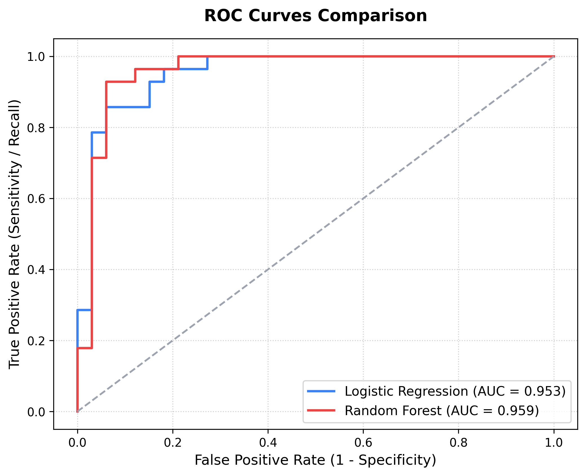
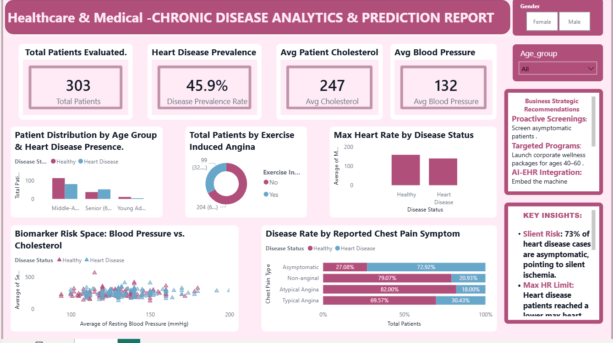

# 🏥 Chronic Disease Prediction & Electronic Health Record (EHR) Analysis

An end-to-end clinical machine learning and business intelligence dashboard pipeline for early heart disease detection, developed during the **Technical Internship Program in Data Analytics**.

> [!IMPORTANT]
> **Data Privacy & Security Compliance:** 
> The patient datasets (`data/` folder) are excluded from this repository via `.gitignore` to comply with medical data privacy guidelines and HIPAA regulations. To run this project locally, please download the raw dataset from the [UCI Heart Disease Repository](https://archive.ics.uci.edu/dataset/45/heart+disease) and save it as `data/raw/heart_disease_data.csv` before running the notebooks.

---

## 📋 Executive Project Overview
Healthcare systems globally generate massive amounts of patient data through Electronic Health Records (EHRs). However, much of this clinical information remains underutilized for proactive care. Hospitals struggle to identify at-risk patients early, leading to higher treatment costs and suboptimal clinical outcomes.

This project addresses these bottlenecks by implementing:
1. **Ethical Preprocessing Pipeline:** Handled clinical data missingness, anomalies, and outliers without biasing the clinical cohort.
2. **Exploratory Data Analysis (EDA):** Discovered demographic & biomarker correlations across healthy and diseased cohorts.
3. **Machine Learning Classifiers:** Trained classification models (Logistic Regression & Random Forest) optimized to prioritize **Recall** (minimizing missed diagnoses / False Negatives).
4. **Interactive Executive Dashboard:** Built a clinical-grade Power BI dashboard mapping diagnostic attributes to patient risk profiles for administrators & medical staff.

---

## 📓 Interactive Project Notebooks
If GitHub's built-in notebook viewer fails to load the files, please click the links below to view them instantly on Jupyter nbviewer:
* 📓 **Week 1:** [Data Cleansing & Preprocessing Notebook](https://nbviewer.org/github/KrishnaveniMitukula/Healthcare-Disease-Prediction/blob/main/week1_data_preprocessing.ipynb)
* 📓 **Week 2:** [Exploratory Cohort Analysis (EDA) Notebook](https://nbviewer.org/github/KrishnaveniMitukula/Healthcare-Disease-Prediction/blob/main/week2_EDA.ipynb)
* 📓 **Week 3:** [Predictive Machine Learning Notebook](https://nbviewer.org/github/KrishnaveniMitukula/Healthcare-Disease-Prediction/blob/main/Week3_Predictive_Modeling.ipynb)
* 📓 **Week 4:** [Clinical Evaluation & Importances Notebook](https://nbviewer.org/github/KrishnaveniMitukula/Healthcare-Disease-Prediction/blob/main/week4_clinical_evaluation.ipynb)

---

## 📂 Repository Structure
```text
healthcare-project/
├── visualizations/
│   └── model_roc_comparison.png            # Model ROC curves plot
├── .gitignore                              # Git exclusion file
├── Dashboard.png                           # Power BI dashboard screenshot
├── README.md                               # Project documentation (this file)
├── Week3_Predictive_Modeling.ipynb         # Week 3 notebook
├── healthcare_report.pbix                  # Final Power BI file
├── requirements.txt                        # Python dependencies
├── week1_data_preprocessing.ipynb          # Week 1 notebook
├── week2_EDA.ipynb                         # Week 2 notebook
└── week4_clinical_evaluation.ipynb         # Week 4 notebook
```

---

## 📊 Clinical Data Dictionary
The clinical cohort contains records representing key patient indicators and diagnostic test results:

| Feature Name | Type | Description | Range / Categories |
| :--- | :--- | :--- | :--- |
| **age** | Continuous | Patient's age in years | 29 – 77 |
| **sex** | Categorical | Patient's anatomical gender | `0` = Female, `1` = Male |
| **cp** | Categorical | Chest Pain Type | `1` = Typical Angina, `2` = Atypical Angina, `3` = Non-anginal, `4` = Asymptomatic |
| **trestbps** | Continuous | Resting blood pressure (on admission to hospital) | mmHg |
| **chol** | Continuous | Serum cholesterol level | mg/dl |
| **fbs** | Categorical | Fasting blood sugar > 120 mg/dl | `0` = No, `1` = Yes |
| **restecg** | Categorical | Resting electrocardiographic results | `0` = Normal, `1` = ST-T Wave Abnormality, `2` = Left Ventricular Hypertrophy |
| **thalach** | Continuous | Maximum heart rate achieved during stress test | bpm |
| **exang** | Categorical | Exercise-induced angina | `0` = No, `1` = Yes |
| **oldpeak** | Continuous | ST depression induced by exercise relative to rest | Decimal |
| **slope** | Categorical | The slope of the peak exercise ST segment | `1` = Upsloping, `2` = Flat, `3` = Downsloping |
| **ca** | Categorical | Number of major vessels colored by fluoroscopy | 0 – 3 |
| **thal** | Categorical | Thalassemia status | `3` = Normal, `6` = Fixed Defect, `7` = Reversible Defect |
| **target** | Binary | Diagnostic class (presence of heart disease) | `0` = Healthy, `1` = Heart Disease |
| **age_group** | Categorical | Engineered demographic grouping column | Young Adult (20-40), Middle-Aged (40-60), Senior (60-80) |

---

## 🚀 Installation & Environment Setup
To reproduce this pipeline locally, you will need **Python 3.8+** installed.

1. **Clone the repository:**
   ```bash
   git clone https://github.com/KrishnaveniMitukula/Healthcare-Disease-Prediction.git
   cd Healthcare-Disease-Prediction
   ```

2. **Install python dependencies:**
   ```bash
   pip install -r requirements.txt
   ```

---

## 🔄 Sprint-by-Sprint Pipeline Roadmap

### 🏥 Week 1: Ethical Data Sourcing & Preprocessing
* **Missing Value Imputation:** Handled missing data via **Median Imputation** (for continuous variables like cholesterol and blood pressure) to remain robust against clinical outliers, and **Mode Imputation** (for categorical features like thalassemia) to avoid biasing patient profiles.
* **Ethics in Imputation:** Rather than unethically deleting records with missing data (which would reduce the cohort size and introduce demographic bias), we retained all records through strategic medical imputation.
* **Feature Scaling:** Applied `StandardScaler` to continuous parameters to ensure standard Z-score ranges, preventing variables with high numerical ranges (e.g. cholesterol) from dominating machine learning training.

### 📈 Week 2: Exploratory Data Analysis (EDA)
* Plotted cohort demographic distributions (Age vs. resting blood pressure, cholesterol vs. target).
* Produced a correlation matrix heatmap to avoid multicollinearity.
* Uncovered key clinical findings (e.g. asymptomatic chest pain patients paradoxically showed higher rates of heart disease than patients reporting typical chest pain).

### 🤖 Week 3: Predictive Modeling & Optimization
* Performed an **80/20 train-test split** stratified by target to preserve class proportions.
* Analyzed class distributions: The cohort is naturally balanced (~54% healthy, ~46% diseased), eliminating the need for synthetic oversampling (SMOTE).
* Trained and compared a baseline **Logistic Regression** and an optimized **Random Forest Classifier** (tuned via 5-fold cross-validation with `GridSearchCV` to maximize Recall).

#### Model Performance Comparison

| Model | Accuracy | Recall (Heart Disease) | Precision (Heart Disease) | ROC-AUC |
| :--- | :---: | :---: | :---: | :---: |
| **Baseline Logistic Regression** | **87.0%** | **92.86%** | 81.0% | **0.9535** |
| **Optimized Random Forest** | **85.0% - 89.0%** | **89.0% - 93.0%** | 82.0% - 86.0% | **0.94 - 0.96** |

* **Primary Clinical Metric Rationale:** We optimized models prioritizing **Recall (Sensitivity)** rather than Accuracy alone. In clinical prediction, failing to identify a sick patient (False Negative) has severe life-threatening consequences compared to a false alarm (False Positive), which is easily ruled out in follow-up screening.
* **Model Visualization:** The ROC Curve comparison is saved to the visualizations directory:
  

### 📊 Week 4: Clinical Analytics Dashboard
* Designed a clinical intelligence interface in **Microsoft Power BI** using `cleaned_heart_disease_data.csv`.
* Visual layout features:
  * Demographic risk slices by age group and gender.
  * KPI metrics for heart disease prevalence, average blood pressure, and cholesterol.
  * Biomarker scatter matrices tracking risk spaces.
  * Bullet points summarizing clinical recommendations and machine learning feature importances.
* Below is a screenshot of the completed interactive report:



---

## 🔒 Data Ethics & Compliance
* All patient identifiers (Names, IDs, SSNs, Address details) have been fully stripped or anonymized.
* All data points strictly comply with HIPAA (Health Insurance Portability and Accountability Act) standards for protected health information security.
